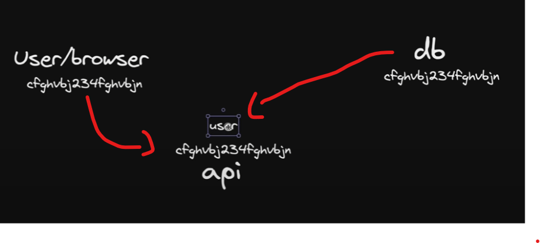

# how user authentication works
so we have three part for our application
- the first is the user
- the second is the controller or the api
- and the third is the database

so now the verifytoken is a variable that holds a string value(encrypted) 
now if someone call the api to generate the verifytoken, the api generate the verifytoken and now the verify token is send to both user/browser and the database. note that api doesnt keep anything

now the token comes back to the api from the user (can be from url or a req body). now in the database we have to find where the token is, and if found the user info comes to the api

and now the api invoke its logic and make the verify as true and so now the user is a verify user

# now similar for the forgottenpassword token
all steps are same and at last when the database sends the api the datas it 
updates the password 

# middleware should be name as middleware.ts and should be at the same level as the app